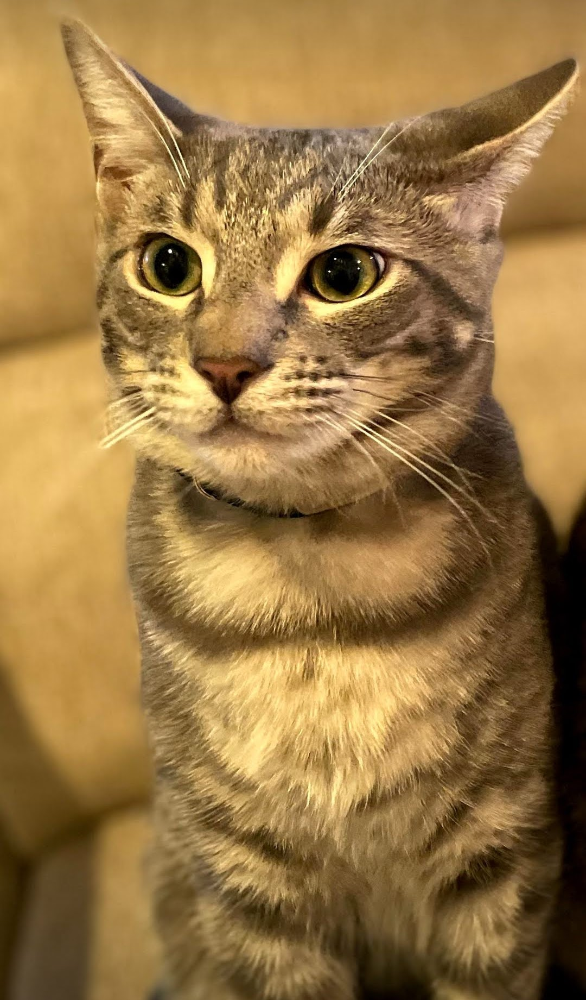
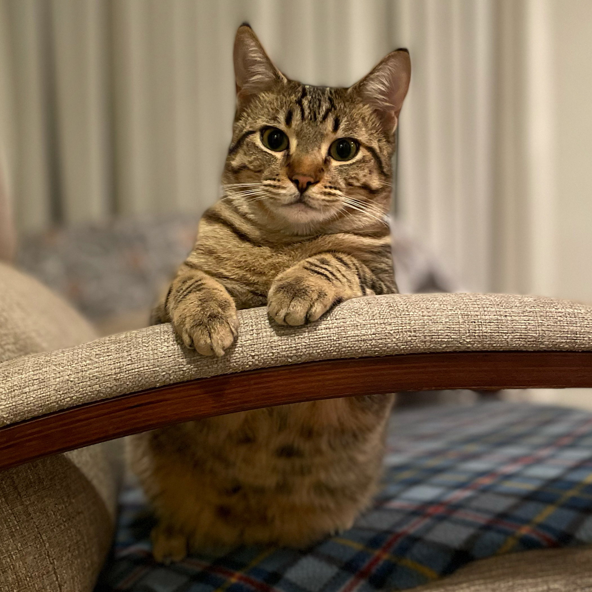

These are my tabby cats. They were found in a dumpster and I love them. They also know tricks like sit, turn around, up, paw, and explain how magnets work. 

# Gauss 
---
So much thought behind those eyes. He's definitely borrowing his cousin Goose's brain cell. Goose is an orange tabby cat. 

# Ada 
---
She's your guide. She will tell you the way. She also has asthma - I didn't know cat's could get asthma.
