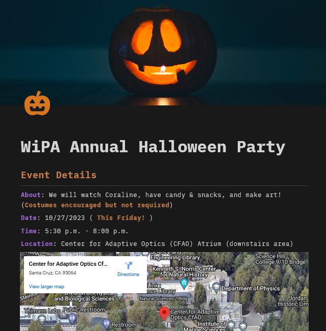
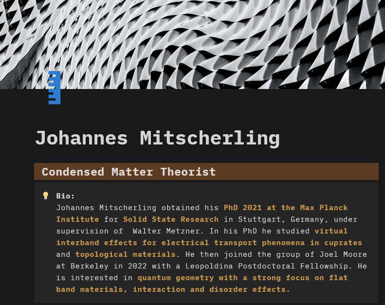
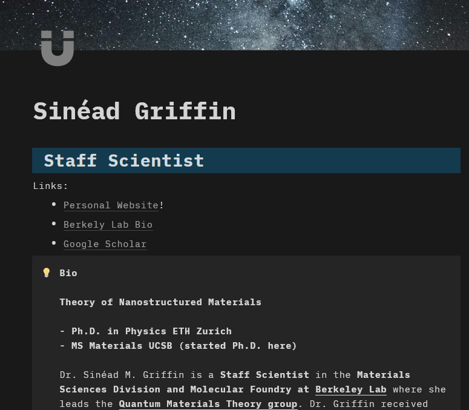
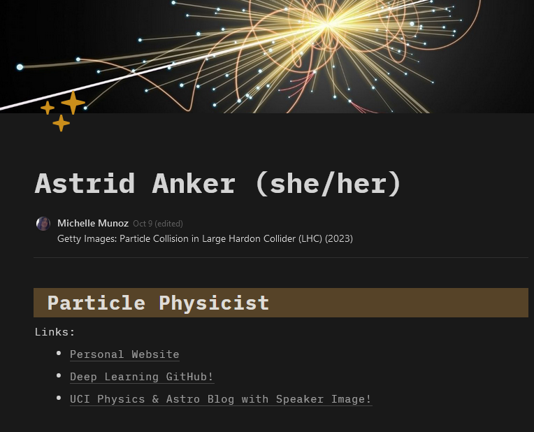

# The Group

---

The UC Santa Cruz Women in Physics and Astrophysics (WiPA)!\
View the main website: [WiPA](https://ucscwomeninphysics.wixsite.com/ucscwipa/about)

``
Our mission is to bring together everyone - not just women - interested in working toward a balanced and diverse community in physics and astronomy at UCSC and beyond.
"- WiPA

# My Contributions

---

I'm a chat and tech officer for the group.

> ## Chat
>
> I like to create promotional pages with Notion. c: \
> Here's our Halloween page!\
> [Halloween Party!](https://drixitel.notion.site/WiPA-Annual-Halloween-Party-0bb28613bb2f44dcbdcf2211d0cad18c?pvs=4) > 

> Here are some promotional pages on some cool visiting speakers!
>
> [Condensed Matter Theorist](https://drixitel.notion.site/Johannes-Mitscherling-40b8cd34a62846fbad11c415a900a065) > 
>
> [Staff Scientist at Berkeley Lab](https://drixitel.notion.site/Sin-ad-Griffin-527def890b344b2bbd7fcfe4f70b30ff) > 
>
> [Particle Physicist](https://drixitel.notion.site/Astrid-Anker-she-her-1b7d920f79b84fef87ea01b8e819fe4c) > 

> ## Tech
>
> I help with programming inquiries from our members

    Python, C/C++, Fortran, Matlab, Scientific Computation
